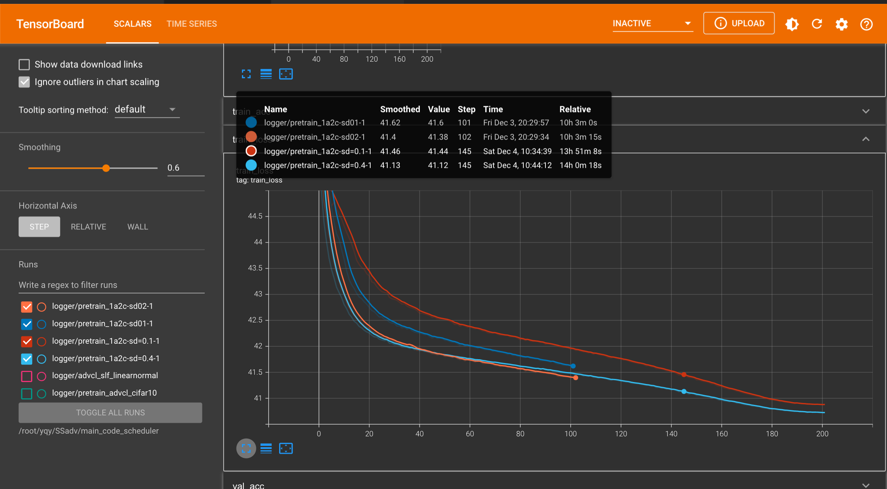
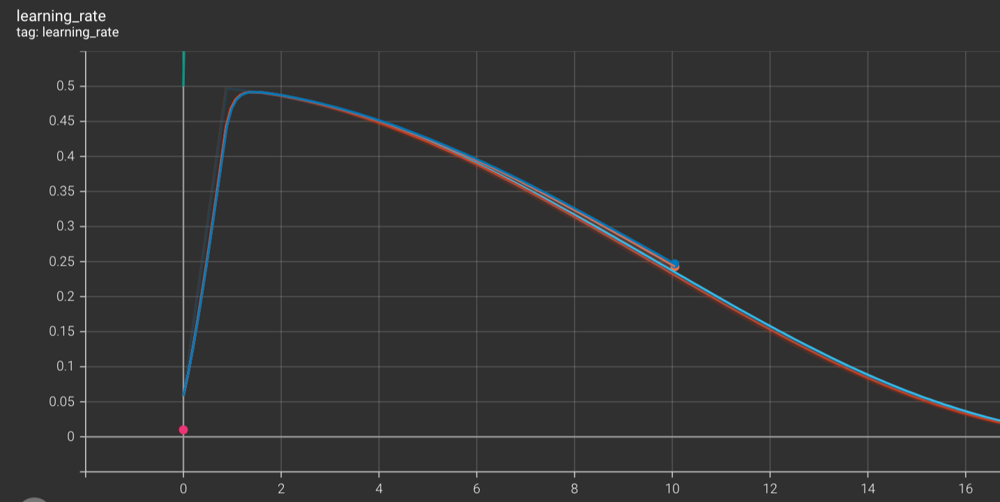
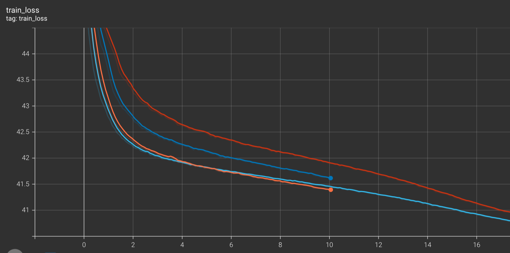

tensorboard_logger

Now we can use tensorboard on vscode online like this




All we need to do is import the tensorboard lib

```python
import tensorboard_logger as tb_logger
```

and  instantiate a logger

```python
logger = tb_logger.Logger(logdir=logname, flush_secs=2)
```

log_value is to record value in logger

```python
logger.log_value('train_loss', train_loss, epoch)

logger.log_value('learning_rate', optimizer.param_groups[0]['lr'], epoch)
```

we record train_loss and learning_rate, so we got curves in tb

 



if we use tensorboard on Pytorch, we should do like this

```python
from torch.utils.tensorboard import SummaryWriter 
TensorWriter = SummaryWriter('./tensorboard_data')

TensorWriter.add_scalar('value', value, epoch)
TensorWriter.add_image(...)
```

we need to run the tensorboard in the terminal

```
tensorboard --logdir=runs
```

and open http://localhost:6006/

